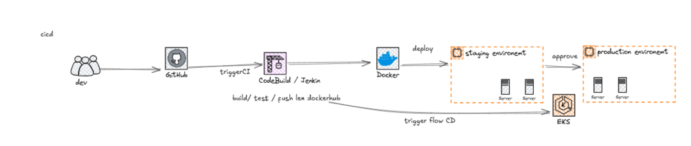
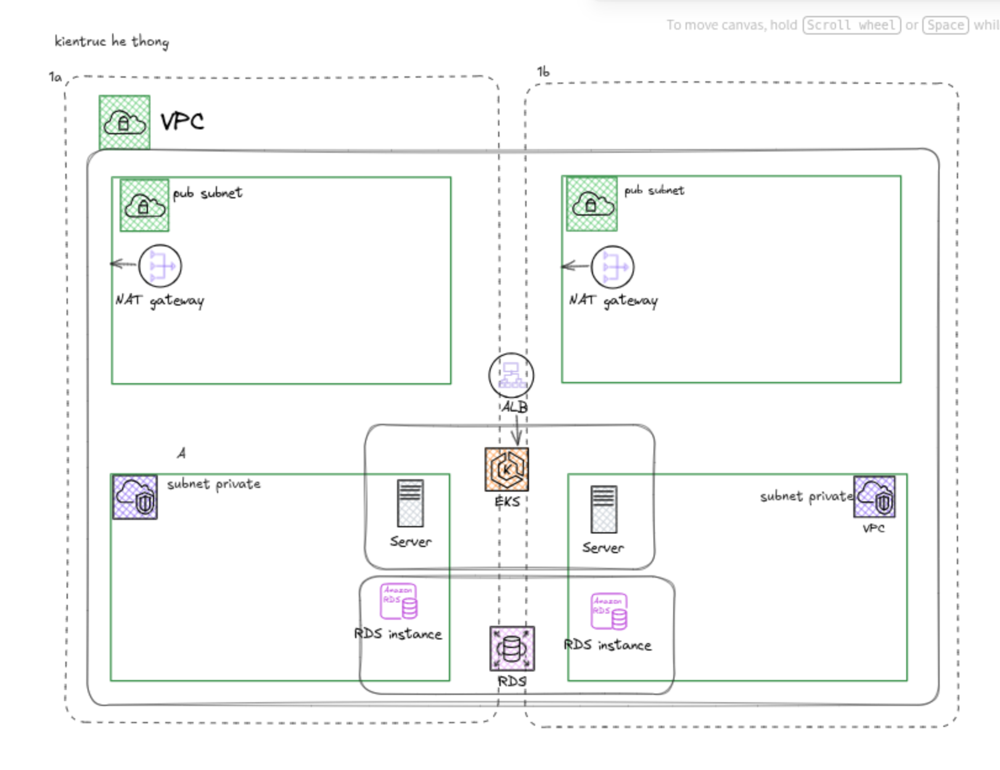
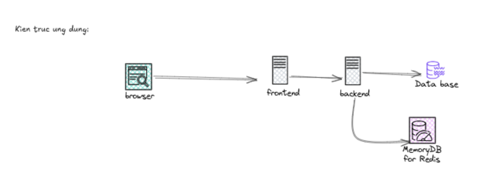

# Đồ án — Stack công nghệ

| Hạng mục | Lựa chọn | Lý do |
|---|---|---|
| **Môi trường** | On-Cloud — AWS (Amazon Web Services) | Dẫn đầu thị trường, tài liệu phong phú, dễ dàng tích hợp các dịch vụ IaC và CI/CD. |
| **Hạ tầng** | Kubernetes (K8s) — Amazon EKS (Elastic Kubernetes Service) | Cung cấp khả năng điều phối container mạnh mẽ, tự động cân bằng tải, quản lý tài nguyên hiệu quả, giảm thiểu downtime. |
| **Công nghệ Backend** | Linh hoạt — Node.js/Express.js (API RESTful) | Phổ biến, hiệu năng cao, dễ dàng đóng gói Docker. |
| **Công nghệ Frontend** | Linh hoạt — React/Next.js/Vue.js | Framework hiện đại, tối ưu trải nghiệm người dùng, dễ dàng build tĩnh hoặc SSR. |
| **Cơ sở dữ liệu** | Managed Service — Amazon RDS for PostgreSQL | Giảm gánh nặng quản trị DB (backup, patching, failover tự động), bảo mật cao. |
| **Triển khai Code** | Automation (CI/CD) — Jenkins / GitLab CI/CD | Tự động hóa toàn bộ quy trình build, test, deploy, đảm bảo tốc độ và sự nhất quán. |
| **Xây dựng Hạ tầng** | IaC (Infrastructure as Code) — Terraform | Quản lý, tái tạo hạ tầng AWS bằng mã nguồn, loại bỏ sai sót thủ công, dễ dàng mở rộng. |

cicd :


kien truc he thong 


kien truc ung dung 



## Cấu trúc thư mục

```
cicd/
├── app/                       # Python Flask app + frontend tĩnh
│   ├── app.py
│   ├── requirements.txt
│   ├── Dockerfile
│   └── static/index.html
├── k8s/
│   └── app.yaml               # Namespace + Secret + Deployment + Service + Ingress
├── k8s-install-jenkins.yaml   # Jenkins master (PVC gp3 + LoadBalancer)
├── terraform/                 # IaC: VPC + EKS + RDS + ECR + EBS CSI + EC2 build machine
└── ci/
    └── Jenkinsfile            # Pipeline chạy trên EC2 agent
```

## Cài đặt

### Yêu cầu

- `aws` CLI v2 đã login (`aws sso login` hoặc access key)
- `terraform` >= 1.5
- `kubectl` >= 1.31
- `docker` (chỉ cần để build/push image app lần đầu, sau đó EC2 agent lo)

### Bước 1 — Dựng hạ tầng

```bash
cd cicd/terraform
terraform init
terraform apply -var="db_password=ChangeMe1234!"
```

Tạo trong ~15 phút: VPC, EKS cluster + nodegroup, RDS, ECR, EBS CSI driver, EC2 build machine, IAM Access Entry.

Outputs:

```
cluster_name             = "cicd-demo-eks"
cluster_endpoint         = "https://...eks.amazonaws.com"
ecr_repository_url       = "<account>.dkr.ecr.ap-southeast-1.amazonaws.com/cicd-demo-app"
rds_endpoint             = "cicd-demo-db.<id>.ap-southeast-1.rds.amazonaws.com"
build_machine_public_ip  = "<EC2_IP>"
build_machine_ssh_key    = "./build-machine-key.pem"
kubeconfig_command       = "aws eks update-kubeconfig --region ap-southeast-1 --name cicd-demo-eks"
```

### Bước 2 — Cấu hình kubectl

```bash
aws eks update-kubeconfig --region ap-southeast-1 --name cicd-demo-eks
kubectl get nodes   # 2 nodes Ready
```

### Bước 3 — Cài Nginx Ingress controller

```bash
kubectl apply -f https://raw.githubusercontent.com/kubernetes/ingress-nginx/controller-v1.11.2/deploy/static/provider/aws/deploy.yaml
kubectl -n ingress-nginx wait --for=condition=Available deployment/ingress-nginx-controller --timeout=180s
```

### Bước 4 — Cài Jenkins master

```bash
kubectl apply -f cicd/k8s-install-jenkins.yaml
kubectl -n jenkins rollout status deployment/jenkins --timeout=240s
```

### Bước 5 — Lấy các URL

```bash
# Jenkins
kubectl -n jenkins get svc jenkins -o jsonpath='{.status.loadBalancer.ingress[0].hostname}'

# App (qua Nginx Ingress ALB)
kubectl -n ingress-nginx get svc ingress-nginx-controller -o jsonpath='{.status.loadBalancer.ingress[0].hostname}'

# Initial Jenkins admin password
kubectl -n jenkins exec deploy/jenkins -- cat /var/jenkins_home/secrets/initialAdminPassword
```

> Terraform không xuất Jenkins URL ra output vì LoadBalancer được Kubernetes provision sau, không phải Terraform. Dùng `kubectl` ở trên để lấy.

### Bước 6 — Setup Jenkins master

Mở Jenkins URL → unlock + cài plugin + tạo admin user:

1. **Unlock Jenkins** → paste initial admin password (lấy ở bước 5).
2. **Install suggested plugins** (~2-3 phút).
3. **Create First Admin User** → username/password tùy chọn → Save → Save.

### Bước 7 — Đăng ký EC2 làm JNLP agent

**Trên Jenkins UI:**

1. **Manage Jenkins → Nodes → New Node**:
   - Node name: `ec2-build`, Type: `Permanent Agent` → Create.
2. Form node:
   - Remote root directory: `/home/ubuntu/jenkins`
   - Labels: `ec2-build`
   - Launch method: `Launch agent by connecting it to the controller`
   - Save.
3. Click node `ec2-build` → copy đoạn lệnh `java -jar agent.jar ...` (có chứa SECRET).

**Trên EC2:**

```bash
ssh -i cicd/terraform/build-machine-key.pem ubuntu@<EC2_IP>

# Tải agent.jar và chạy (paste lệnh từ Jenkins UI)
mkdir -p ~/jenkins && cd ~/jenkins
curl -fsSL http://<JENKINS_URL>/jnlpJars/agent.jar -o agent.jar
java -jar agent.jar -url http://<JENKINS_URL>/ -secret <SECRET> -name ec2-build -workDir /home/ubuntu/jenkins
```

Để chạy background bằng systemd:

```bash
sudo tee /etc/systemd/system/jenkins-agent.service > /dev/null <<EOF
[Unit]
Description=Jenkins JNLP Agent
After=network.target

[Service]
User=ubuntu
WorkingDirectory=/home/ubuntu/jenkins
ExecStart=/usr/bin/java -jar /home/ubuntu/jenkins/agent.jar -url http://<JENKINS_URL>/ -secret <SECRET> -name ec2-build -workDir /home/ubuntu/jenkins
Restart=always

[Install]
WantedBy=multi-user.target
EOF
sudo systemctl daemon-reload && sudo systemctl enable --now jenkins-agent
```

### Bước 8 — Tạo Pipeline job

1. Jenkins trang chủ → **New Item** → tên `cicd-demo` → **Pipeline** → OK.
2. Section **Pipeline**:
   - Definition: `Pipeline script from SCM`
   - SCM: `Git`
   - Repository URL: `https://github.com/<user>/mock-projects.git`
   - Branch: `*/main`
   - Script Path: `cicd/ci/Jenkinsfile`
3. Tick **GitHub hook trigger for GITScm polling** → Save.

### Bước 9 — GitHub webhook

GitHub repo → Settings → **Webhooks → Add webhook**:

- Payload URL: `http://<JENKINS_URL>/github-webhook/`
- Content type: `application/json`
- Events: `Just the push event` → Add webhook.

### Bước 10 — Deploy app lần đầu

Pipeline chỉ làm `kubectl set image` nên cần deployment tồn tại sẵn. Lần đầu apply manifest (sau đó pipeline tự lo update):

```bash
ACCOUNT_ID=$(aws sts get-caller-identity --query Account --output text)
REGION=ap-southeast-1
REPO=$ACCOUNT_ID.dkr.ecr.$REGION.amazonaws.com/cicd-demo-app
RDS_ENDPOINT=$(terraform -chdir=cicd/terraform output -raw rds_endpoint)

# Build + push image lần đầu (sau này pipeline lo)
aws ecr get-login-password --region $REGION | docker login --username AWS --password-stdin $REPO
docker build -t $REPO:v1 cicd/app/
docker push $REPO:v1

# Apply manifest
sed \
  -e "s|REPLACE_WITH_RDS_ENDPOINT|$RDS_ENDPOINT|" \
  -e 's|REPLACE_WITH_PASSWORD|ChangeMe1234!|' \
  -e "s|REPLACE_WITH_ECR_URI:latest|$REPO:v1|" \
  cicd/k8s/app.yaml | kubectl apply -f -
```

Xong — `git push` để trigger pipeline đầu tiên.

## Dọn dẹp (Destroy)

⚠️ **Thứ tự quan trọng**: xóa Kubernetes Service type=LoadBalancer + PVC TRƯỚC khi `terraform destroy`. Nếu destroy terraform trước, AWS LoadBalancers (NLB/ALB) và EBS volume sẽ bị orphan và phát sinh phí.

```bash
# 1. Xóa app + ingress + jenkins (sẽ release các LoadBalancer + EBS volume)
kubectl delete -f cicd/k8s/app.yaml --ignore-not-found
kubectl delete -f cicd/k8s-install-jenkins.yaml --ignore-not-found
kubectl delete -f https://raw.githubusercontent.com/kubernetes/ingress-nginx/controller-v1.11.2/deploy/static/provider/aws/deploy.yaml --ignore-not-found

# 2. Đợi vài chục giây cho AWS cleanup các LB
sleep 60

# 3. Destroy infrastructure
cd cicd/terraform
terraform destroy -var="db_password=ChangeMe1234!"
```

Kiểm tra sau khi xong:

```bash
aws elbv2 describe-load-balancers --region ap-southeast-1   # nên empty
aws ec2 describe-volumes --region ap-southeast-1 --filters Name=status,Values=available   # nên empty
```

Nếu vẫn còn LB/volume orphan: xóa thủ công qua AWS Console hoặc CLI để tránh chi phí.
